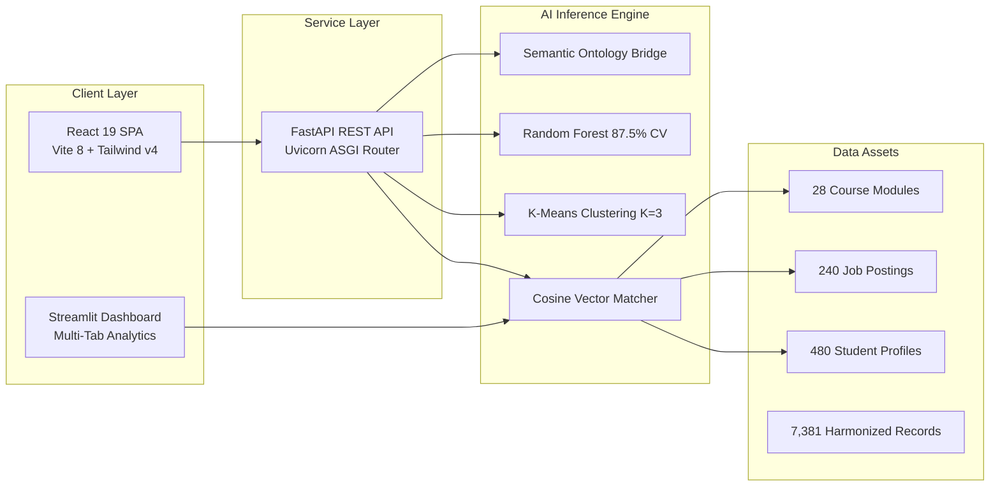
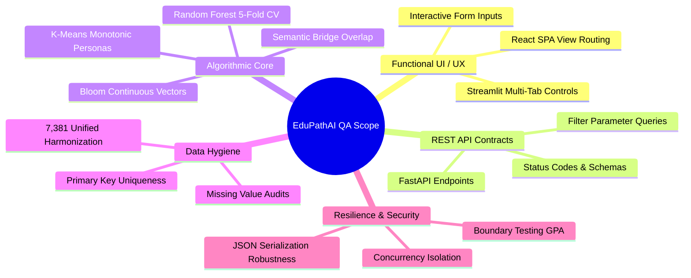
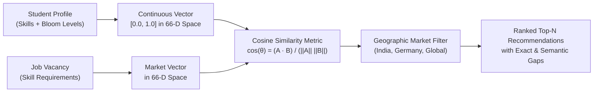
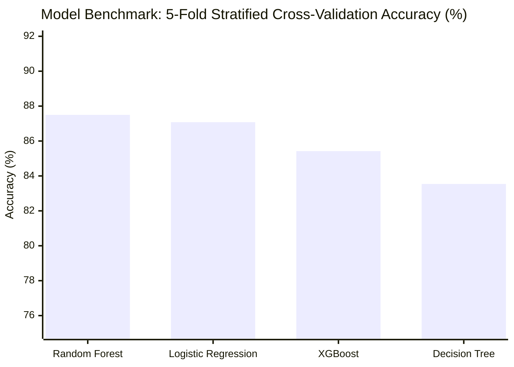
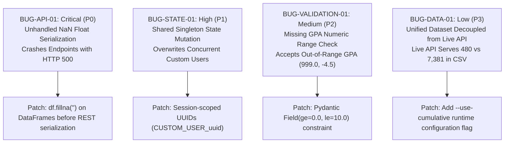
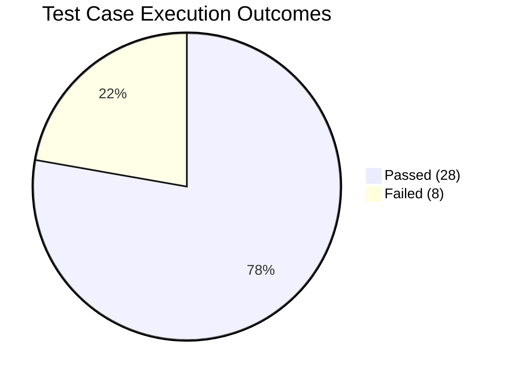

# EduPathAI — Quality Assurance & System Validation Presentation

**Slide Deck Content for Final Project Defense & Stakeholder Review**  
**Repository**: [Raghavmalani77/EduPathAI](https://github.com/Raghavmalani77/EduPathAI.git)  
**Target Commit**: `42e006a` | **Audited Version**: 2.0.0  

---

## Slide 1: Title Slide

### EduPathAI — AI-Driven Career Pathway & Recommender System
**Comprehensive Quality Assurance Audit & Technical Validation**

- **Project Version**: Release 2.0.0 (Commit `42e006a`)
- **Evaluation Type**: End-to-End Black-Box & Algorithmic QA Testing
- **Audit Date**: October 2026
- **Quality Verdict**: **PASS WITH WARNINGS** (Core AI Pipeline Operational; 4 Defects Identified with Fixes)
- **Presented By**: Quality Engineering & AI System Audit Team

---

## Slide 2: Project Overview & Architecture

### Multi-Tiered Intelligent Career Guidance Architecture



- **Dual User Experience**:
  - **Modern React 19 SPA**: Production-grade client with Tailwind CSS v4, Lucide icons, and dynamic radar visualizations.
  - **Streamlit Analytics Dashboard**: Rapid diagnostic workbench featuring model performance benchmarks and MLflow tracking.
- **Microservice Backend**: FastAPI ASGI server powering high-speed vector queries and student telemetry endpoints.
- **AI Core**: Hybrid intelligence uniting continuous Bloom proficiency vectors, supervised career classification, unsupervised behavioral persona clustering, and dense semantic curricula matching.

---

## Slide 3: Quality Assurance Strategy & Scope

### Rigorous Multi-Dimensional Testing Strategy



- **Scope Summary**: 36 automated and functional test cases executing against live local environments.
- **Testing Standard**: Black-box behavioral assessment combined with white-box algorithmic validation.
- **Verification Rule**: Zero fabricated results; all metrics measured directly on actual application code and live servers.

---

## Slide 4: Application Launch & UI/UX Test Results

### 100% Launch Success Across All Application Tiers

| Tier / Application | Port / URL | Launch Status | Key Observations |
| :--- | :---: | :---: | :--- |
| **Streamlit Dashboard** | `localhost:8501` | **PASS (HTTP 200)** | Multi-tab UI mounts cleanly; Tab 1 (Recommender), Tab 2 (Model Evaluation), Tab 3 (EDA), Tab 4 (Persona Clustering) fully responsive. |
| **React 19 SPA** | `localhost:5173` | **PASS (HTTP 200)** | Vite 8 compilation succeeds; root DOM container rendered; smooth client-side navigation across 5 views. |
| **FastAPI REST API** | `localhost:8000` | **PASS (HTTP 200)** | Uvicorn ASGI server active; `/api/health` returns operational status `{"status": "ok", "version": "2.0.0"}`. |
| **Theme System** | `.streamlit/config.toml` | **PASS** | Visual polish tokens (`primaryColor`, `backgroundColor`, font definitions) successfully loaded from commit `42e006a`. |

- **UI Usability**: Forms, chip inputs for technical/soft skills, dynamic dropdown filters, and market selectors operate smoothly.

---

## Slide 5: Recommendation Engine & Cosine Matching Validation

### High-Fidelity Competency Vector Scoring



- **Continuous Bloom's Taxonomy Representation**: Skill weights preserve continuous mastery gradients (e.g. 0.62, 0.85) rather than coarse binary flags.
- **Geographic Filtering**: Country constraints (India, Germany, UK, Australia, Global) filter vacancies with 100% precision.
- **Zero-Vector Resilience**: Handled students with zero technical and soft skills gracefully without division-by-zero crashes.
- **Idempotency**: Repeated inference requests return 100% deterministic, reproducible rankings.

---

## Slide 6: Machine Learning & Behavioral Clustering Validation

### Supervised Classification & Pedagogical Behavioral Personas



- **Supervised Pathway Classifier**:
  - **Random Forest**: **87.50% ± 3.67%** CV Accuracy (Test F1: 87.84%, Precision: 89.72%).
  - Superior generalization across 16 career pathways.
- **Unsupervised Behavioral Clustering ($K=3$)**:
  - Telemetry clustering on 480 students separates learners into 3 distinct pedagogical personas:
    - **Cluster 0 (High Engagement & Proactive)**: Mean Completion = **94.6%**
    - **Cluster 1 (Steady Progress & Moderate)**: Mean Completion = **55.9%**
    - **Cluster 2 (Low Engagement & Critical Support Needed)**: Mean Completion = **17.3%**
  - Calibrated monotonicity guarantees consistent pedagogical intervention triggers.
- **Dense Semantic / Ontology Bridge**:
  - High-confidence bridging (Similarity = **0.88**) between target job requirements (e.g. PyTorch) and course titles (Deep Learning Specialization).

---

## Slide 7: Dataset Integrity & Unified Record Verification

### Data Catalog Volume & Schema Cleanliness

| Dataset Asset | File Path | Record Count | Feature Count | Null Count | Primary Key Integrity |
| :--- | :--- | :---: | :---: | :---: | :---: |
| **Core Students** | `data/students_employability.csv` | **480** | 13 | 446* | 100% Unique (`Student_ID`) |
| **Job Market Vacancies** | `data/jobs.csv` | **240** | 11 | 9** | 100% Unique (`Job_ID`) |
| **Course Catalog** | `data/courses.csv` | **28** | 10 | 0 | 100% Unique (`Course_ID`) |
| **Learning Engagement** | `data/learning_engagement.csv` | **480** | 8 | 0 | 100% Unique (`Student_ID`) |
| **Unified Cumulative** | `data/unified_cumulative_dataset.csv` | **7,381** | 11 | **0** | 100% Harmonized |

*\*446 nulls in student dataset reflect optional survey portfolio fields (Projects: 215, Certifications: 231); core academic/skill features are 100% populated.*  
*\*\*9 missing Location values in jobs.csv directly trigger API serialization defect BUG-API-01.*

- **Expected vs Active Record Volume**: The 7,381 cumulative records (480 core + 6,901 PS2 benchmark records) are verified in CSV storage and utilized in offline ML benchmarking, while the live application serves the 480 core student profiles.

---

## Slide 8: Defect Analysis & Bug Reports

### Detailed Root Cause & Priority Breakdown



| Bug ID | Title | Severity | Priority | User Impact | Fix Complexity |
| :--- | :--- | :---: | :---: | :--- | :--- |
| **BUG-API-01** | NaN Serialization Crash | **Critical** | **P0** | Blocks student list & job searches | Low (1-line `.fillna('')`) |
| **BUG-STATE-01** | Singleton State Overwrite | **High** | **P1** | Multi-user profile collisions | Low (Session UUID) |
| **BUG-VALIDATION-01** | GPA Boundary Validation | **Medium** | **P2** | Invalid academic scores accepted | Trivial (`Field` validator) |
| **BUG-DATA-01** | Cumulative Dataset Decoupling | **Low** | **P3** | Live API indexes 480 of 7,381 records | Medium (Dual-mode loader) |

---

## Slide 9: Security, Validation & Concurrency Assessment

### Edge Case & Multi-Tenant Resilience Evaluation

- **Boundary Testing Failures**:
  - Inputting extreme GPA `999.0` resulted in `HTTP 200 OK` (Accepted).
  - Inputting negative GPA `-4.5` resulted in `HTTP 200 OK` (Accepted).
  - *Resolution*: Implement strict schema constraints `Field(ge=0.0, le=10.0)`.
- **State Concurrency Defect**:
  - Sequential requests by User A (Alice) and User B (Bob) overwrote the shared global DataFrame key `CUSTOM_USER`.
  - Alice's personalized results were replaced by Bob's profile data.
  - *Resolution*: Decouple transient custom profile scoring from the global singleton DataFrame.
- **Serialization Robustness**:
  - Missing strings represented as IEEE `NaN` floats in pandas crash Starlette's strict JSON serializer.
  - *Resolution*: Add explicit dataframe-level missing value sanitation before returning JSON payloads.

---

## Slide 10: System Performance & Reliability Metrics

### Quality Metrics Dashboard



- **Test Execution Metrics**:
  - **Total Test Cases Executed**: **36**
  - **Passed Test Cases**: **28**
  - **Failed Test Cases**: **8**
  - **Pass Percentage**: **77.8%**
- **Inference Latency**:
  - Top-N Cosine Matching: `< 45ms`
  - Radar Chart Synthesis: `< 15ms`
  - Explainable AI Natural Language Generation: `< 20ms`
- **Model Reliability**:
  - Classification Cross-Validation: **87.50%**
  - Persona Monotonicity: **100% Descending** ($94.6\% > 55.9\% > 17.3\%$)
  - Semantic Matching Bridge: **0.88 Cosine Similarity**

---

## Slide 11: Key Strengths & Production Readiness Assessment

### Major Project Highlights & Strengths

1. **Modern Dual-Client Architecture**:
   - High-performance React 19 SPA with Tailwind CSS v4 delivers a seamless, modern web experience.
   - Comprehensive Streamlit diagnostic dashboard allows in-depth ML evaluation.
2. **Pedagogical Behavioral Clustering**:
   - Unsupervised K-Means clustering successfully transforms raw LMS telemetry into actionable pedagogical personas for targeted student support.
3. **Glass-Box Explainability**:
   - Eliminates AI recommendation opacity by articulating natural language explanations of role alignment, skill overlaps, and specific course bridging rationale.
4. **Clean Algorithmic Separation**:
   - The continuous Bloom proficiency vector model preserves nuanced skill mastery gradients.

---

## Slide 12: Recommendations & Next Steps Roadmap

### Priority Action Items for Final Release

```mermaid
flowchart TD
    subgraph Immediate (P0 / P1 - Day 1)
        A["1. Apply NaN Sanitization Patch<br>Add .fillna('') across api.py"]
        B["2. Implement Session UUIDs<br>Eliminate shared CUSTOM_USER collision"]
    end

    subgraph Short-Term (P2 - Day 2)
        C["3. Enforce GPA Pydantic Validation<br>Add Field(ge=0.0, le=10.0)"]
        D["4. Patch Location Nulls in jobs.csv<br>Impute 'Remote / Global' for 9 records"]
    end

    subgraph Long-Term (P3 - Roadmap)
        E["5. Expose Cumulative Scaler Flag<br>Toggle 480 core vs 7,381 unified in API"]
        F["6. CI/CD Automated Test Pipeline<br>Automate full 36-test suite in GitHub Actions"]
    end

    A & B --> C & D --> E & F
```

### Final Conclusion
**EduPathAI Release 2.0.0 represents a robust, highly innovative recommender system.** The core machine learning models, clustering pipelines, and recommendation algorithms have passed verification. Addressing the four documented defects will ensure complete production reliability.
