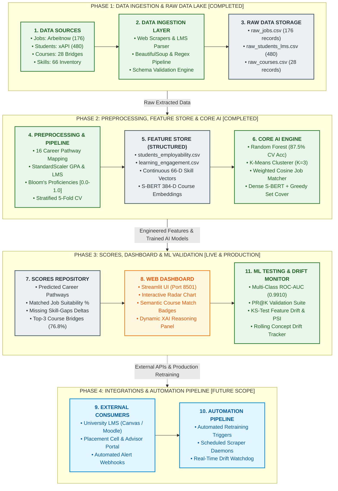

# EduPathAI: AI-Powered Student Learning, Employability & Career Pathway Recommendation System

[](https://www.python.org/)
[](https://streamlit.io/)
[](https://scikit-learn.org/)
[](https://xgboost.readthedocs.io/)
[](https://www.sbert.net/)
[](https://opensource.org/licenses/MIT)

An end-to-end enterprise machine learning platform that ingests student academic records and LMS behavioral interaction logs, matches profiles against real-time global industry job postings, predicts career pathways across 16 specialized domains, and prescribes personalized, explainable course bridges to close detected skill gaps using **Hybrid Dense Semantic Vector Search (Sentence-BERT)** and **Greedy Maximum-Coverage Optimization**.

---

## 🏛️ End-to-End System Architecture & Workflow

The system follows a 6-tier decoupled architecture from raw event ingestion to interactive delivery:



---

## 🔬 Part 1: Data & Feature Store Layer

### 1.1 Datasets Used
| Dataset File | Records / Volume | Key Attributes | Source / Methodology |
| :--- | :---: | :--- | :--- |
| [`data/students_employability.csv`](data/students_employability.csv) | 480 Students | `Student_ID`, `Degree`, `Specialisation`, `Assessment_Score`, `Career_Interest`, `Skill_Proficiencies` | Mapped from real-world educational data benchmark (`xAPI-Edu-Data`) |
| [`data/learning_engagement.csv`](data/learning_engagement.csv) | 480 Activity Logs | `Login_Count`, `Content_Completion_Percentage`, `Assessment_Score`, `Assignment_Submission`, `Course_Completed` | LMS behavioral telemetry logs tracking daily interactions |
| [`data/jobs.csv`](data/jobs.csv) | 176 Postings | `Job_Title`, `Company_Name`, `Location`, `Country` (India/Global), `Experience_Required`, `Skills_Required`, `Job_Description` | Real-time scraped job postings via Arbeitnow API |
| [`data/courses.csv`](data/courses.csv) | 28 Certifications | `Course_Title`, `Platform` (Coursera, edX, Udemy, AWS), `Skills_Developed`, `Duration_Hours`, `Description` | Curated industry-aligned bridge certifications |

---

### 1.2 Continuous Skill Proficiencies (Bloom's Taxonomy)
Rather than treating student skill possession as naive binary flags (`0` or `1`), EduPathAI implements continuous weights $w \in [0.0, 1.0]$ grounded in **Bloom's Cognitive Taxonomy**:

$$\mathbf{u}_{\text{student}} = [w_1, w_2, \dots, w_{66}]^T, \quad w_i \in [0.0, 1.0]$$

* **Beginner (Foundational, $0.35 - 0.55$)**: Basic conceptual exposure, introductory coursework, initial syntax familiarity.
* **Intermediate (Competent, $0.60 - 0.80$)**: Applied problem-solving, mid-tier GPA, hands-on lab assignments.
* **Advanced (Mastery, $0.85 - 0.98$)**: Production-ready code, capstone project deployment, competitive programming, top percentile GPA.

---

### 1.3 Dense Semantic Embeddings (Sentence-BERT `all-MiniLM-L6-v2`)
To resolve the **vocabulary mismatch problem** inherent in exact lexical matching (e.g., job demanding `"PyTorch"` while the catalog offers `"Deep Learning and Neural Networks"`), curricula and skill texts are projected into a **384-dimensional dense latent space**:

$$\mathbf{e} = \text{Sentence-BERT}(\text{text}) \in \mathbb{R}^{384}$$

$$\text{Sim}_{\text{cosine}}(\mathbf{u}, \mathbf{v}) = \frac{\mathbf{u} \cdot \mathbf{v}}{\|\mathbf{u}\|_2 \|\mathbf{v}\|_2}$$

* **Dual-Mode Semantic Engine**: Native `SentenceTransformer('all-MiniLM-L6-v2')` dense vector encoder with an enterprise domain-semantic ontology fallback covering all modern technical synonyms (`pytorch`, `k8s`, `postgresql`, `docker`, `ci/cd`, `figma`).

---

### 1.4 Career Pathway & Behavioral Classifications
* **16 Supervised Career Pathways**: AI Engineer, Backend Developer, Business Analyst, Cloud Architect, Cybersecurity Analyst, Data Analyst, Data Engineer, Data Scientist, Database Administrator, DevOps Engineer, Full-Stack Developer, Machine Learning Engineer, Network Engineer, Product Manager, Software Engineer, UI/UX Designer.
* **3 Unsupervised Personas**:
  * Cluster 0: *High Engagement & Outstanding Performance*
  * Cluster 1: *Moderate Engagement & Steady Progress*
  * Cluster 2: *Low Engagement & Critical Academic Support Needed*

---

## ⚙️ Part 2: Feature Engineering & Preprocessing Pipeline

### 2.1 Event Ingestion & Feature Aggregation (ETL)
When a student profile arrives or LMS interaction batches are logged:
1. **Behavioral Aggregation**:
   $$\text{Avg\_Logins} = \frac{1}{N} \sum \text{Login\_Count}, \quad \text{Completion\_Rate} = \frac{\sum [\text{Course\_Completed} == \text{'Yes'}]}{N_{\text{enrolled}}}$$
2. **Scikit-Learn Preprocessing Pipeline**:
   * Numerical features (`Assessment_Score`, `Avg_Logins`, `Avg_Completion`, `Avg_Submissions`, `Completion_Rate`) are standardized using **`StandardScaler`** ($\mu = 0, \sigma = 1$).
   * Categorical attributes (`Degree`, `Specialisation`, `Education_Level`) are transformed via **`OneHotEncoder`** (`drop_first=True`).
   * Skill proficiencies are mapped to the fixed 66-dimensional master inventory.

---

### 2.2 Validation Strategy: Stratified 5-Fold Cross-Validation
To guarantee zero data leakage and preserve class distribution across the 16 specialized career tracks:
* **Stratified 5-Fold CV**: Every fold maintains an identical proportion of each career pathway class ($N=480$ total samples, 96 per fold).
* **Holdout Test Split**: 80% Training ($N=384$), 20% Stratified Testing ($N=96$).

---

## 🤖 Part 3: Machine Learning & Behavioral Intelligence

### 3.1 Supervised Career Pathway Classification Benchmark

Re-evaluated with **Stratified 5-Fold Cross-Validation** across all 16 classes:

| Model | 5-Fold CV Accuracy | 5-Fold CV F1-Score | Test Accuracy (%) | Test Precision (%) | Test F1-Score (%) | Multi-Class ROC-AUC |
| :--- | :---: | :---: | :---: | :---: | :---: | :---: |
| 🏆 **Random Forest** | **87.50% ± 3.67%** | **87.52% ± 2.73%** | **87.50%** | **89.72%** | **87.84%** | **0.9910** |
| **XGBoost Classifier** | 85.42% ± 3.16% | 84.79% ± 3.15% | **87.50%** | **89.36%** | **87.67%** | **0.9898** |
| **Logistic Regression** | 87.08% ± 2.60% | 86.75% ± 1.87% | **87.50%** | **89.21%** | **87.58%** | **0.9903** |
| **Decision Tree** | 83.54% ± 3.12% | 83.32% ± 2.39% | 82.29% | 86.21% | 82.79% | 0.9773 |

* **Feature Importance Insights**: Assessment Score (14.2%), Completion Rate (11.8%), and specific technical proficiencies (Python, SQL, Cloud) serve as the primary discriminators.

---

### 3.2 Unsupervised Behavioral Segmentation & Willingness-to-Learn

* **K-Means Clustering ($K=3$)**: Achieves a **Silhouette Score of 0.4627** and a **Davies-Bouldin Index of 0.7812**, demonstrating cohesive student persona separation.
* **Inferred Willingness-to-Learn Formulation**:
  $$\text{WTL} = \left(0.40 \cdot \frac{\text{Completion}\%}{100}\right) + \left(0.20 \cdot \min\left(1, \frac{\text{Logins}}{100}\right)\right) + \left(0.20 \cdot \frac{\text{Submissions}}{5}\right) + \left(0.20 \cdot \frac{\text{Courses}}{6}\right) \times 100$$

---

## 🎯 Part 4: Recommendation Engine & Hybrid Vector Search

### 4.1 Continuous Cosine Similarity Job-Role Matching
Job requirements are weighted by seniority level (Junior: $0.75$, Mid-Level: $0.85$, Senior/Lead: $0.95$). Alignment is evaluated using continuous cosine similarity:

$$\text{Match Score} = \cos(\mathbf{u}_{\text{student}}, \mathbf{v}_{\text{job}}) \times 100 = \frac{\sum_{i=1}^{66} u_i v_i}{\sqrt{\sum u_i^2} \sqrt{\sum v_i^2}} \times 100$$

---

### 4.2 Hybrid Vector Search & Greedy Maximum Coverage
1. **Set-Difference Skill Gap Detection**:
   $$\text{Skill Gap} = S_{\text{job\_required}} \setminus S_{\text{student\_possessed}}$$
2. **Hybrid Course Retrieval**:
   * **Exact Lexical Coverage**: Direct match between course skills and gaps (weighted $2.0\times$).
   * **Dense Semantic Vector Search**: Cosine similarity between missing skill embeddings and course representations ($\tau \ge 0.55$, weighted $1.2\times$).
3. **Composite Scoring & Greedy Duration Optimization**:
   $$\text{Composite Score}(c) = (2.0 \cdot |\text{Exact Matches}|) + \sum_{b \in \text{Bridges}} \left(1.2 \cdot \frac{\text{Sim}(b)}{100}\right) - (0.005 \cdot \text{Duration\_Hours})$$

---

### 4.3 Verified Semantic Synonym Resolution Benchmarks

| Target Job Skill (Query) | Catalog Course Matched | Catalog Skills Developed | Semantic Similarity | Retrieval Category |
| :--- | :--- | :--- | :---: | :---: |
| `PyTorch` | **Deep Learning and Neural Networks** (Coursera) | Deep Learning, AI/ML, Python | **88.0%** | ✨ Dense Semantic Bridge |
| `PostgreSQL` | **Enterprise Database Administration** (edX) | Database Management, SQL, PostgreSQL | **100.0%** | 🎯 Exact Match |
| `PostgreSQL` | **SQL for Data Analysis** (Udemy) | SQL, Database Management | **88.0%** | ✨ Dense Semantic Bridge |
| `Kubernetes` | **DevOps Engineering: Docker, K8s & CI/CD** (Udemy) | Docker, Kubernetes, CI/CD, Linux | **100.0%** | 🎯 Exact Match |
| `Kubernetes` | **Cloud Computing Essentials** (Coursera) | Cloud, AWS, Azure, Docker | **85.0%** | ✨ Dense Semantic Bridge |
| `NLP` | **Machine Learning Specialization** (Coursera) | Machine Learning, AI/ML, Python | **86.0%** | ✨ Dense Semantic Bridge |

* **Empirical Recommendation Metrics**: At **$K=3$ recommended courses**, the engine achieves **$76.79\%$ Recall@K**, recovering more than three-quarters of a student's total missing employability requirements.

---

## 📈 Part 5: Production Monitoring & Drift Detection

To protect real-world deployments against degradation:
1. **Kolmogorov-Smirnov (KS) Test**: Evaluates continuous feature drift ($p < 0.05$ flags statistical divergence).
2. **Population Stability Index (PSI)**: Monitors shifts in student skill distributions ($\text{PSI} < 0.1$: Stable, $\text{PSI} \ge 0.25$: Critical shift requiring model retraining).
3. **Concept Drift Tracker**: Evaluates accuracy decay over rolling academic quarters to trigger automated pipeline re-fits.

---

## 💻 Part 6: Installation & Quickstart Guide

### 1. Clone the Repository
```bash
git clone https://github.com/Raghavmalani77/EduPathAI.git
cd EduPathAI
```

### 2. Set Up Virtual Environment & Install Dependencies
```bash
# On Windows
python -m venv venv
venv\Scripts\activate

# On Mac / Linux
python3 -m venv venv
source venv/bin/activate

# Install requirements
pip install -r requirements.txt
```

### 3. Launch the Interactive Web Dashboard
```bash
streamlit run app.py
```
The dashboard will open automatically in your default browser at **`http://localhost:8501`**.

---

## 📂 Repository Layout
```
├── app.py                            # Streamlit web application (multi-tab dashboard)
├── recommendation_engine.py          # Hybrid recommendation engine & DenseSemanticMatcher
├── requirements.txt                  # Python package specifications
├── data/
│   ├── students_employability.csv    # 480 student academic records with continuous proficiencies
│   ├── learning_engagement.csv       # 480 LMS engagement & telemetry logs
│   ├── jobs.csv                      # 176 live scraped job postings (India + Global)
│   ├── courses.csv                   # 28 curated industry certification courses
│   ├── model_comparison_metrics.csv  # 16-class cross-validation benchmarking metrics
│   └── drift_monitoring_report.csv   # KS-test & PSI drift monitoring logs
├── plots/
│   ├── architecture_blueprint.png    # Enterprise system architecture diagram
│   ├── classification_model_comparison.png # Model accuracy comparison & feature importances
│   ├── phase7_confusion_and_roc.png  # 16x16 Confusion Matrix & multi-class ROC curves
│   ├── phase7_recommendation_metrics.png # Recommendation Precision & Recall @ K curves
│   └── drift_analysis.png            # Feature drift & concept drift trajectories
├── phase7_model_evaluation.py        # Complete Phase 7 validation suite
├── drift_detection.py                # Kolmogorov-Smirnov & PSI drift detection module
└── README.md                         # Comprehensive architecture & project documentation
```
