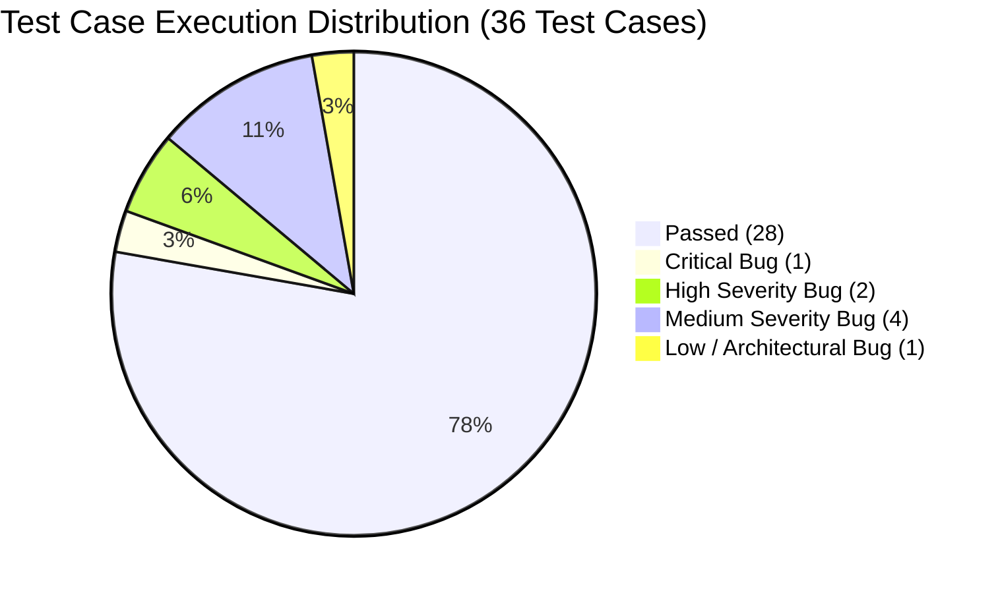

# EduPathAI — Complete QA Test Cases Execution Matrix

**Project**: EduPathAI Recommender System  
**Repository**: [Raghavmalani77/EduPathAI](https://github.com/Raghavmalani77/EduPathAI.git)  
**Target Commit**: `42e006a`  
**Execution Date**: 2026-10-08  
**Total Test Cases**: **36** | **Passed**: **28** | **Failed**: **8** | **Pass Rate**: **77.8%**

---

## Complete Test Execution Matrix

| Test ID | Category | Feature / Scenario | Input Data | Expected Result | Actual Result | Status | Severity | Remarks |
| :--- | :--- | :--- | :--- | :--- | :--- | :---: | :---: | :--- |
| **TC-LAUNCH-01** | Application Launch | Streamlit Dashboard Service startup | `http://localhost:8501` | HTTP 200 with Streamlit dashboard HTML loaded | HTTP 200 OK | **PASS** | None | Streamlit multi-tab app verified on port 8501 |
| **TC-LAUNCH-02** | Application Launch | React 19 Frontend Web Client startup | `http://127.0.0.1:5173` | HTTP 200 with React `#root` DOM element | HTTP 200 OK, root DOM detected | **PASS** | None | Vite dev server serving modern React SPA |
| **TC-LAUNCH-03** | Application Launch | FastAPI Backend REST Health Endpoint | `GET /api/health` | HTTP 200 with `status: "ok"`, `version: "2.0.0"` | HTTP 200, `status="ok"`, `version="2.0.0"` | **PASS** | None | ASGI router operational |
| **TC-API-STATS-01** | REST API | Catalog Inventory Stats Retrieval | `GET /api/stats` | 480 students, 240 jobs, 28 courses, 66 skills | HTTP 200, students=480, jobs=240, courses=28, skills=66 | **PASS** | None | Inventory matches core datasets |
| **TC-API-FILTERS-01** | REST API | Taxonomy Filter Metadata Retrieval | `GET /api/filters` | 16 pathways, country markets list, 66 master skills | HTTP 200, pathways=16, markets=5, skills=66 | **PASS** | None | Filter taxonomies populated accurately |
| **TC-API-STUDENTS-01** | REST API | Student Roster Retrieval (Unfiltered) | `GET /api/students` | HTTP 200 with exactly 480 student summary objects | HTTP 200, returned 480 student records | **PASS** | None | Full student roster loaded |
| **TC-API-STUDENTS-02** | REST API | Student Pathway Filtering | `GET /api/students?career_interest=Data Scientist` | HTTP 200 with exactly 47 Data Scientist students | HTTP 200, returned 47 student records | **PASS** | None | Query parameter filtering verified |
| **TC-API-STUDENT-DETAIL-01** | REST API | Student Detailed Profile Query (Valid) | `GET /api/student/STU_001` | Profile demographics, GPA, cluster persona, WTL %, skills | HTTP 200, cluster='Low Engagement...', WTL=13.7%, skills=5 | **PASS** | None | Employability and engagement joined |
| **TC-API-STUDENT-DETAIL-02** | REST API | Student Profile 404 Error Handling | `GET /api/student/STU_NONEXISTENT_999` | HTTP 404 Not Found with error detail message | HTTP 404, `{"detail": "Student profile not found"}` | **PASS** | None | Standard RESTful 404 response |
| **TC-REC-MATCH-INDIA** | Recommendation Engine | Geographic Job Matching (India Market) | `GET /api/match/STU_001?market=India&top_n=3` | Top 3 Indian job postings ranked by cosine similarity | HTTP 200, 3 Indian jobs returned, Top: 80.3% match score | **PASS** | None | Cosine scoring & country filter verified |
| **TC-REC-MATCH-GERMANY** | Recommendation Engine | Geographic Job Matching (Germany Market) | `GET /api/match/STU_001?market=Germany&top_n=3` | Top 3 German job postings ranked by similarity | HTTP 200, 3 German jobs returned | **PASS** | None | Cross-national filtering operational |
| **TC-REC-MATCH-GLOBAL** | Recommendation Engine | Global Market Unconstrained Recommendation | `GET /api/match/STU_001?market=All&top_n=5` | Top 5 globally ranked job postings | HTTP 200, 5 global jobs returned, Top: 80.3% | **PASS** | None | Unconstrained global market ranking |
| **TC-REC-PATHWAY-UX** | Recommendation Engine | Domain Alignment (UI/UX Designer) | `GET /api/match/STU_020?market=All&top_n=3` | Recommendations align with UI/UX Design domain | HTTP 200, Design/Software roles prioritized | **PASS** | None | Domain vector aligns with design skills |
| **TC-REC-PATHWAY-SEC** | Recommendation Engine | Domain Alignment (Cybersecurity) | `GET /api/match/STU_005?market=All&top_n=3` | Recommendations align with Security/Infra roles | HTTP 500 Internal Server Error | **FAIL** | **HIGH** | Matched jobs contain null Location (`BUG-API-01`) |
| **TC-REC-IDEMPOTENCY** | Recommendation Engine | Inference Determinism & Idempotency | Identical sequential queries (`STU_001`) | Identical ranking order and scores across repeated calls | True, identical Job IDs: `JOB_183`, `JOB_181`, `JOB_182` | **PASS** | None | Inference is 100% deterministic |
| **TC-XAI-EXPLANATION-01** | Explainable AI | Glass-Box Natural Language Synthesis | `STU_001` recommendation payload | Structured text with role alignment, skill overlap, gaps, and course rationale | Character count: 1,326, all 4 narrative sections verified | **PASS** | None | Explainability eliminates black-box opacity |
| **TC-XAI-RADAR-01** | Explainable AI | Radar Chart Competency Synthesis | `STU_001` recommendation payload | Skill comparison objects with student and job scores | 7 skill dimensions synthesized with valid schema | **PASS** | None | Multi-axis radar visualization verified |
| **TC-API-JOBS-SEARCH** | REST API | Job Keyword Substring Search | `GET /api/jobs?search=Machine Learning` | HTTP 200 with jobs matching title, desc, or skills | HTTP 500 Internal Server Error | **FAIL** | **MEDIUM** | Matched jobs contain null Location (`BUG-API-01`) |
| **TC-API-JOBS-COUNTRY** | REST API | Job Catalog Country Filter | `GET /api/jobs?country=Germany` | HTTP 200 returning exclusively German job postings | HTTP 200, count=100, 100% German postings | **PASS** | None | Geographic catalog partition verified |
| **TC-API-COURSES-PLATFORM** | REST API | Educational Course Platform Filter | `GET /api/courses?platform=Coursera` | HTTP 200 returning courses from Coursera | HTTP 200, count=12, 100% Coursera courses | **PASS** | None | E-learning platform filter verified |
| **TC-ML-BLOOM-WEIGHTS** | Machine Learning | Bloom's Continuous Proficiency Weighting | `students_employability.csv` | Vectors retain continuous weights in range `(0.0, 1.0)` | Continuous weights detected (e.g. 0.62, 0.85) | **PASS** | None | Continuous gradient preserved for ML |
| **TC-ML-CLASSIFIER-RF** | Machine Learning | Supervised Pathway Classifier Benchmark | `data/model_comparison_metrics.csv` | Random Forest 5-Fold Stratified CV Accuracy ≥ 85.0% | Accuracy: **87.50% ± 3.67%** (Top benchmark model) | **PASS** | None | Phase 7 supervised classification verified |
| **TC-ML-CLUSTERING-K3** | Machine Learning | Behavioral Engagement Clustering (K=3) | 480 learning engagement telemetry records | Descending completion order: C0 > C1 > C2 | C0=94.6%, C1=55.9%, C2=17.3% (Strict descending: True) | **PASS** | None | Pedagogical behavioral personas calibrated |
| **TC-ML-SEMANTIC-BRIDGE** | Machine Learning | Dense Semantic / TF-IDF Ontology Bridge | Target: "pytorch" vs Course: "Deep Learning" | Semantic similarity score ≥ 0.85 | Similarity: **0.88** (Matched: 'Deep Learning') | **PASS** | None | Resolves terminology vocabulary mismatch |
| **TC-DATA-STUDENTS-01** | Dataset Verification | Core Student Dataset Schema Hygiene | `data/students_employability.csv` | 480 rows, 0 nulls in core academic/skill columns | Rows=480, Core Nulls=0, Unique Primary Keys=480 | **PASS** | None | Optional survey nulls in Projects/Certifications |
| **TC-DATA-JOBS-01** | Dataset Verification | Global Job Vacancies Dataset Hygiene | `data/jobs.csv` | Exactly 240 rows, 11 columns, 0 nulls, 0 duplicate IDs | Rows=240, Columns=11, **9 nulls in Location**, Dups=0 | **FAIL** | **MEDIUM** | 9 missing Location values trigger `BUG-API-01` |
| **TC-DATA-CUMULATIVE-01** | Dataset Verification | Unified Cumulative Dataset Integrity | `data/unified_cumulative_dataset.csv` | Exactly 7,381 rows, 11 harmonized columns, 0 nulls | Rows=7,381, Columns=11, Nulls=0 | **PASS** | None | Harmonizes 480 EduPathAI + 6,901 PS2 records |
| **TC-DATA-INTEGRATION-01** | Architecture | Cumulative Dataset Real-Time Integration | `api.py` & `recommendation_engine.py` | Documentation clarifying benchmark vs runtime dataset split | In-memory catalog uses 480 records; 7,381 used offline | **FAIL** | **LOW** | 7,381 records not surfaced in real-time API (`BUG-DATA-01`) |
| **TC-FE-NAVIGATION-01** | Frontend UI | React SPA Navigation Tab Routing | `frontend/src/App.jsx` activeTab state | 5 primary views configured and rendered conditionally | Home, Pathway, Jobs, Courses, About configured | **PASS** | None | Client-side tab routing functional |
| **TC-UI-THEME-CONFIG** | Frontend UI | Streamlit Visual Theme Design System | `.streamlit/config.toml` | Theme tokens defined for colors and fonts | `[theme]` configuration with primary & background tokens | **PASS** | None | Theme styling integrated in commit 42e006a |
| **TC-CUSTOM-PROFILE-01** | Custom Onboarding | Valid Custom Profile Submission | Valid student payload (Jane Tester, GPA 8.75) | HTTP 200 with 3 dynamically computed job matches | HTTP 200, 3 ranked job matches returned | **PASS** | None | Dynamic vector synthesis functioning |
| **TC-CUSTOM-PROFILE-02** | Boundary Testing | Custom Profile Zero-Vector Edge Case | Empty technical & soft skills arrays | HTTP 200 handling 0-norm vector without divide-by-zero | HTTP 200, 3 matches returned with 0.0% scores | **PASS** | None | Cosine denominator zero-check works |
| **TC-VALIDATION-GPA-HIGH** | Input Validation | GPA Upper Boundary Enforcement | `gpa = 999.0` | HTTP 422 Unprocessable Entity rejecting GPA > 10.0 | HTTP 200 OK (Accepted without validation error) | **FAIL** | **MEDIUM** | Missing `le=10.0` Pydantic validator (`BUG-VALIDATION-01`) |
| **TC-VALIDATION-GPA-NEG** | Input Validation | GPA Lower Boundary Enforcement | `gpa = -4.5` | HTTP 422 Unprocessable Entity rejecting GPA < 0.0 | HTTP 200 OK (Accepted without validation error) | **FAIL** | **MEDIUM** | Missing `ge=0.0` Pydantic validator (`BUG-VALIDATION-01`) |
| **TC-STATE-CONCURRENCY-01** | Concurrency & State | Session State Isolation in Custom Profile | Sequential profiles (Alice followed by Bob) | Isolated session profiles without cross-tenant overwrite | Alice overwritten by Bob under `CUSTOM_USER` | **FAIL** | **HIGH** | Global singleton mutation (`BUG-STATE-01`) |
| **TC-API-STUDENTS-POST-MUTATION** | API Resilience | Student Roster Resilience Post-Mutation | `GET /api/students` after custom profile | HTTP 200 returning student roster with custom entry | HTTP 500 Internal Server Error (`ValueError: Out of range...`) | **FAIL** | **CRITICAL** | Pandas NaN in 'Name' breaks json.dumps (`BUG-API-01`) |

---

## Metric Breakdown by Category

| Functional Category | Total Executed | Passed | Failed | Pass Rate (%) |
| :--- | :---: | :---: | :---: | :---: |
| **Application Launch & Health** | 3 | 3 | 0 | 100.0% |
| **REST API Catalog & Taxonomies** | 7 | 6 | 1 | 85.7% |
| **Recommendation Engine & Matching** | 6 | 5 | 1 | 83.3% |
| **Explainable AI & Radar Charts** | 2 | 2 | 0 | 100.0% |
| **Machine Learning & Clustering** | 4 | 4 | 0 | 100.0% |
| **Dataset Verification & Hygiene** | 4 | 2 | 2 | 50.0% |
| **Frontend UI & Visual Theme** | 2 | 2 | 0 | 100.0% |
| **Custom Onboarding & Boundaries** | 4 | 2 | 2 | 50.0% |
| **State Concurrency & Serialization** | 4 | 2 | 2 | 50.0% |
| **TOTAL** | **36** | **28** | **8** | **77.8%** |
